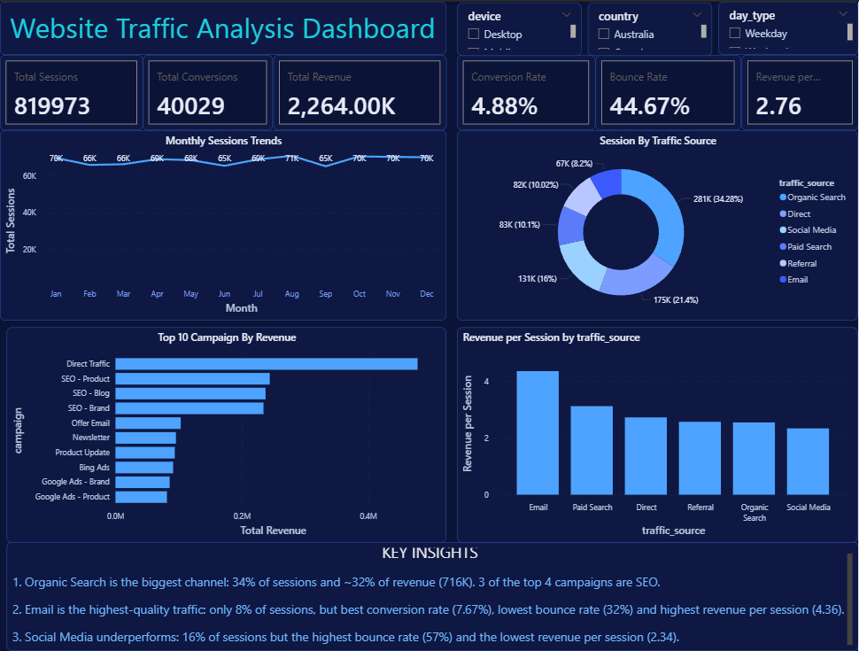

# Website Traffic Analysis Dashboard

An end-to-end data analytics project: raw CSV → **MySQL** (cleaning & analysis) → **Power BI** (data model, DAX, interactive dashboard).

> **Note:** This project uses a **sample (synthetic) dataset** for portfolio purposes. It is not real company data.

---
- [Download Power BI file (.pbix)](Website_traffic_analysisi.pbix) (open in Power BI Desktop)
- 

## Dashboard Preview



**Live report:** _

---

## Objective

Understand how website traffic converts into business value, and find out:

- Which traffic sources and campaigns drive the most sessions and revenue
- Which channels bring **high-quality** traffic (high conversion, low bounce)
- Where there is room to improve

---

## Dataset

| Item | Details |
|---|---|
| Rows | 12,000 |
| Period | 1 Jan 2025 – 31 Dec 2025 (365 days) |
| Granularity | Date + hour level |
| Key columns | Date, Country, City, Traffic Source, Campaign, Device, Landing Page, Users, Sessions, Bounce Rate, Conversions, Revenue |

File: `data/Website_Traffic_Analysis_Dataset.csv`

---

## Tools Used

- **MySQL** – data loading, data quality checks, aggregation queries, view for reporting
- **Power BI Desktop** – Power Query, data modeling, DAX, dashboard design
- **DAX** – KPI measures, time intelligence
- **Git / GitHub** – version control and documentation

---

## Workflow

```
CSV  →  MySQL table  →  Data quality checks  →  SQL analysis
     →  SQL view (v_traffic_clean)  →  Power BI (Import)
     →  Date table + relationship  →  DAX measures  →  Dashboard
```

### 1. Data quality checks (SQL)

- 12,000 rows loaded, totals reconciled with the source file
- 0 NULL values in key columns
- 0 duplicate rows
- Date range valid (365 distinct days)
- Logic checks passed (`new_users ≤ users ≤ sessions`)

### 2. SQL analysis

Key queries (all in [`sql/`](sql/)):

- Overall totals (sessions, conversions, revenue)
- Performance by traffic source
- Top 5 campaigns by revenue
- Monthly sessions and revenue trend

```sql
SELECT traffic_source,
       SUM(sessions)       AS sessions,
       SUM(conversions)    AS conversions,
       ROUND(SUM(revenue)) AS revenue
FROM traffic_data
GROUP BY traffic_source
ORDER BY revenue DESC;
```

### 3. SQL view for Power BI

`v_traffic_clean` adds helper columns so rates can be calculated correctly in Power BI:

- `bounced_sessions = bounce_rate * sessions`
- `total_duration_sec = avg_session_duration_sec * sessions`
- `day_type` (Weekday / Weekend)

Bounce Rate is stored per row, so a simple average would be wrong. It is calculated as a **sessions-weighted** rate instead.

### 4. Power BI model and DAX

- Star-style model: `Dim_Date` (1) → `Fact_traffic` (many)
- `Dim_Date` marked as the date table, Month sorted by Month Number

```dax
Total Sessions = SUM(Fact_traffic[sessions])

Conversion Rate = DIVIDE([Total Conversions], [Total Sessions])

Bounce Rate =
DIVIDE(SUM(Fact_traffic[bounced_sessions]), [Total Sessions])

Revenue per Session = DIVIDE([Total Revenue], [Total Sessions])

Sessions MoM % =
VAR PrevMonth = CALCULATE([Total Sessions], DATEADD(Dim_Date[Date], -1, MONTH))
RETURN DIVIDE([Total Sessions] - PrevMonth, PrevMonth)
```

Full list in [`dax/measures.md`](dax/measures.md).

---

## Dashboard Features

- 6 KPI cards: Sessions, Conversions, Revenue, Conversion Rate, Bounce Rate, Revenue per Session
- Monthly sessions trend (line chart)
- Sessions by traffic source (donut)
- Top 10 campaigns by revenue (bar chart)
- Revenue per session by traffic source
- Slicers: Device, Country, Day Type
- Custom night-sky theme

---

## Key KPIs

| KPI | Value |
|---|---|
| Total Sessions | 819,973 |
| Total Conversions | 40,029 |
| Total Revenue | ~2.26M |
| Conversion Rate | 4.88% |
| Bounce Rate | 44.67% |
| Revenue per Session | 2.76 |

---

## Key Insights

1. **Organic Search is the biggest channel**: 34% of sessions and about 32% of revenue (716K). Three of the top four campaigns are SEO.
2. **Email is the highest-quality traffic**: only 8% of sessions, but the best conversion rate (7.67%), lowest bounce rate (32%) and highest revenue per session (4.36).
3. **Social Media underperforms**: 16% of sessions, but the highest bounce rate (57%) and the lowest revenue per session (2.34).

### Recommendations

- Scale Email campaigns, since they bring the best value per session.
- Keep investing in SEO, the largest revenue source.
- Review Social Media targeting and landing pages to reduce bounce.

---

## Repository Structure

```
├── data/
│   └── Website_Traffic_Analysis_Dataset.csv
├── sql/
│   ├── 01_create_table.sql
│   ├── 02_data_quality_checks.sql
│   ├── 03_analysis_queries.sql
│   └── 04_create_view.sql
├── dax/
│   └── measures.md
├── powerbi/
│   ├── Website_Traffic_Dashboard.pbix
│   └── Night_Sky_Theme.json
├── images/
│   └── dashboard.png
└── README.md
```

---

## How to Run

1. Run `sql/01_create_table.sql` in MySQL and import the CSV into `traffic_data`
2. Run the data quality, analysis and view scripts in order
3. Open `Website_Traffic_Dashboard.pbix` in Power BI Desktop
4. Update the data source (MySQL server and database) and refresh

---

## Author

**Kugan J**
Data Analyst | SQL · Power BI · Excel · Python
[LinkedIn](https://linkedin.com/in/kugan-j) · [GitHub](https://github.com/kugan-29) · [Portfolio](https://kugan-29.github.io/portfolio)
